# ModernWPF UI Library
[](https://gitter.im/ModernWpf/community?utm_source=badge&utm_medium=badge&utm_campaign=pr-badge)

Modern styles and controls for your WPF applications.

## Features
* Modern styles and new features for [the majority of the stock WPF controls](https://github.com/Kinnara/ModernWpf/wiki/Controls#styled-controls).

* Light and dark themes that can be easily customized. A high contrast theme is also included.

* [Additional controls](https://github.com/Kinnara/ModernWpf/wiki/Controls#additional-controls) to help you build modern applications. Some are ported from the [Windows UI Library](https://github.com/microsoft/microsoft-ui-xaml).

* Targets .NET Framework 4.5 and .NET Core 3.0. Runs on Windows Vista SP2 and above.

")

## Quick start
1. Create a new WPF app.

2. Install from NuGet `Install-Package ModernWpfUI`.

3. Edit App.xaml to following:
```xaml
<Application
    ...
    xmlns:ui="http://schemas.modernwpf.com/2019">
    <Application.Resources>
        <ResourceDictionary>
            <ResourceDictionary.MergedDictionaries>
                <ui:ThemeResources />
                <ui:XamlControlsResources />
            </ResourceDictionary.MergedDictionaries>
        </ResourceDictionary>
    </Application.Resources>
</Application>
```

4. Edit MainWindow.xaml to following:
```xaml
<Window
    ...
    xmlns:ui="http://schemas.modernwpf.com/2019"
    ui:WindowHelper.UseModernWindowStyle="True">
    <ui:SimpleStackPanel Margin="12" Spacing="24">
        <TextBlock Text="My first ModernWPF app" Style="{StaticResource HeaderTextBlockStyle}" />
        <Button Content="I am a button" />
        <Button Content="I am an accent button" Style="{StaticResource AccentButtonStyle}" />
    </ui:SimpleStackPanel>
</Window>
```

5. See [the wiki](https://github.com/Kinnara/ModernWpf/wiki) for more information.

## Packages
| NuGet Package | Latest Versions |
| --- | --- |
| [ModernWpfUI][NuGet] | [][NuGet]<br />[][NuGet.Pre] |
| [ModernWpfUI.MahApps][NuGet.MahApps] | [][NuGet.MahApps]<br />[][NuGet.MahApps.Pre] |

## Screenshots
")

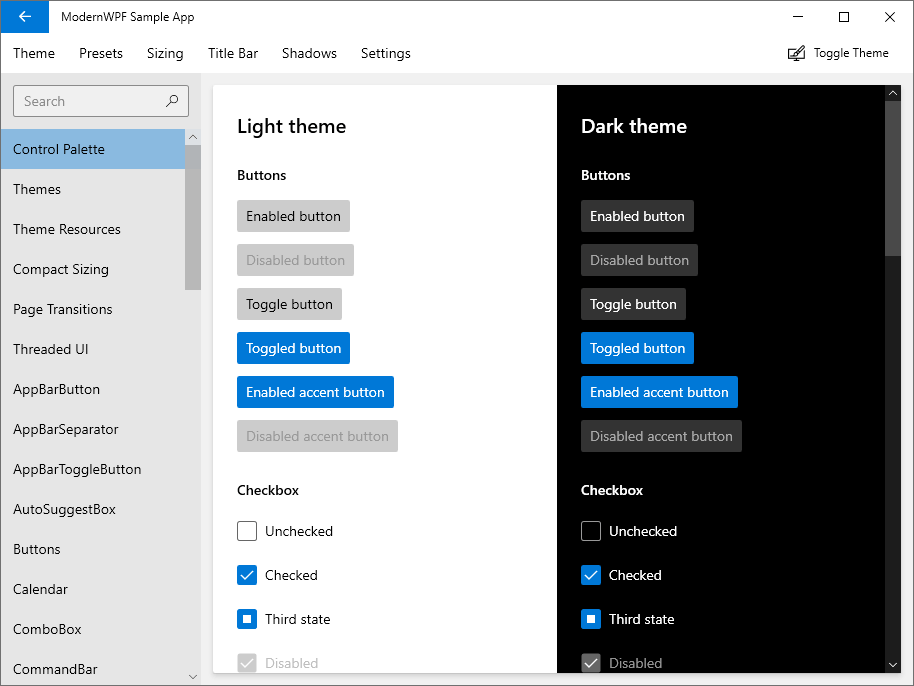

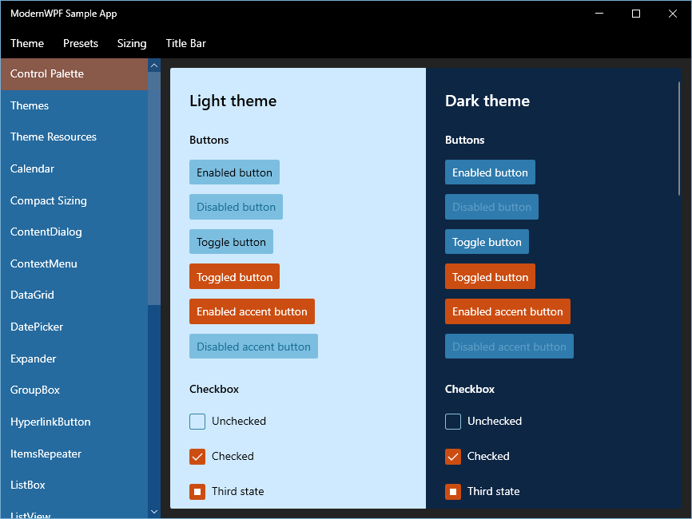

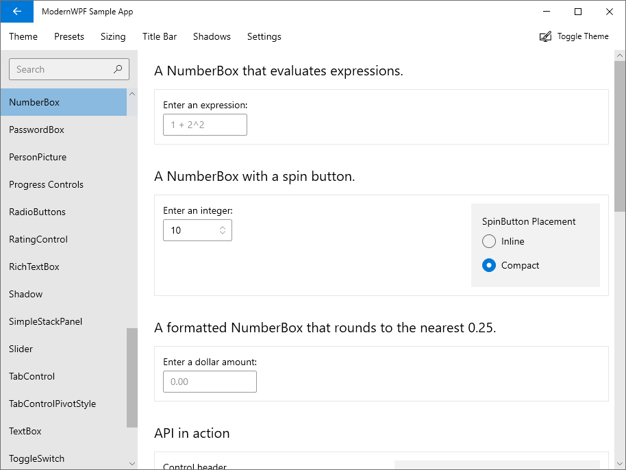

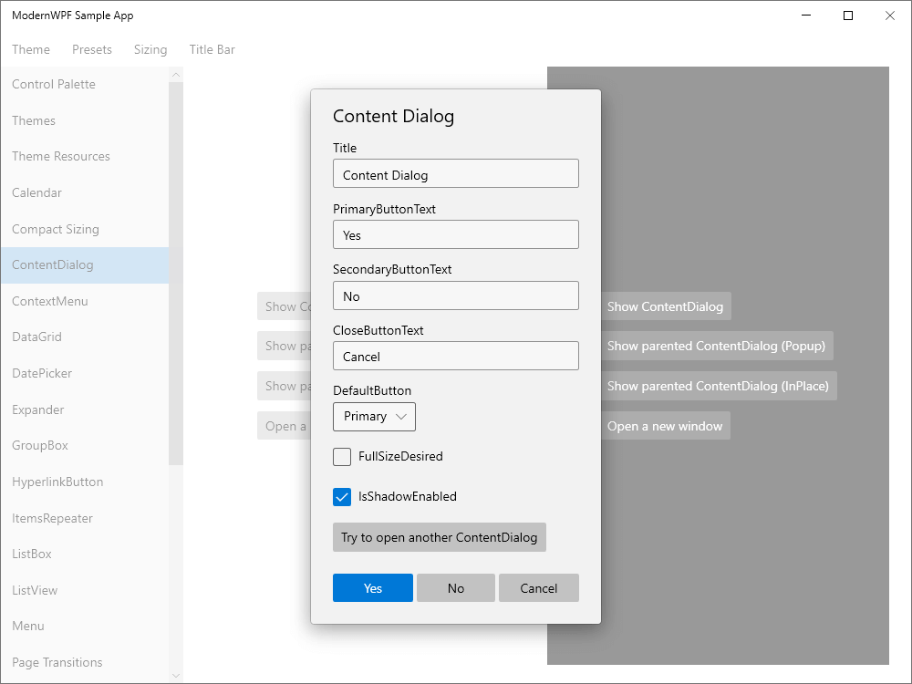

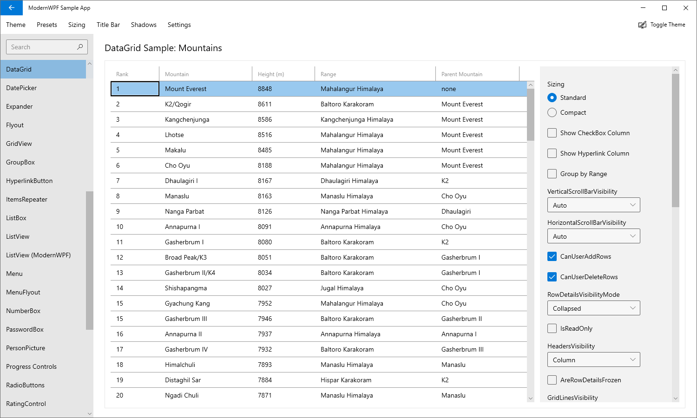


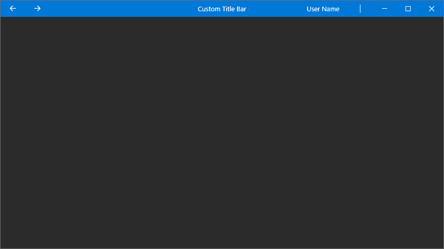

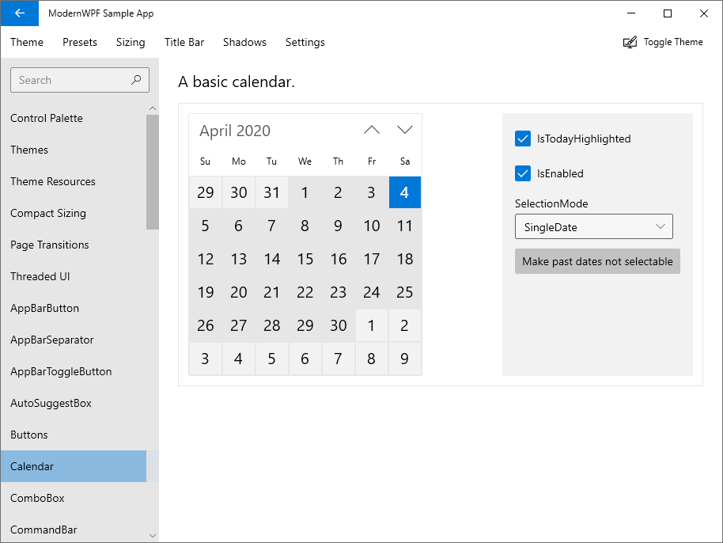

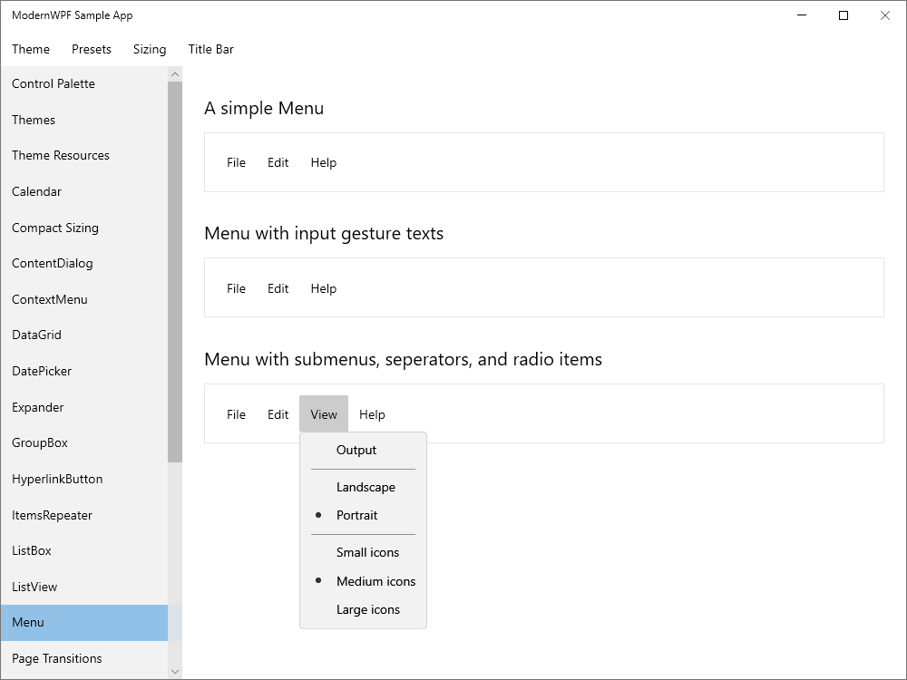

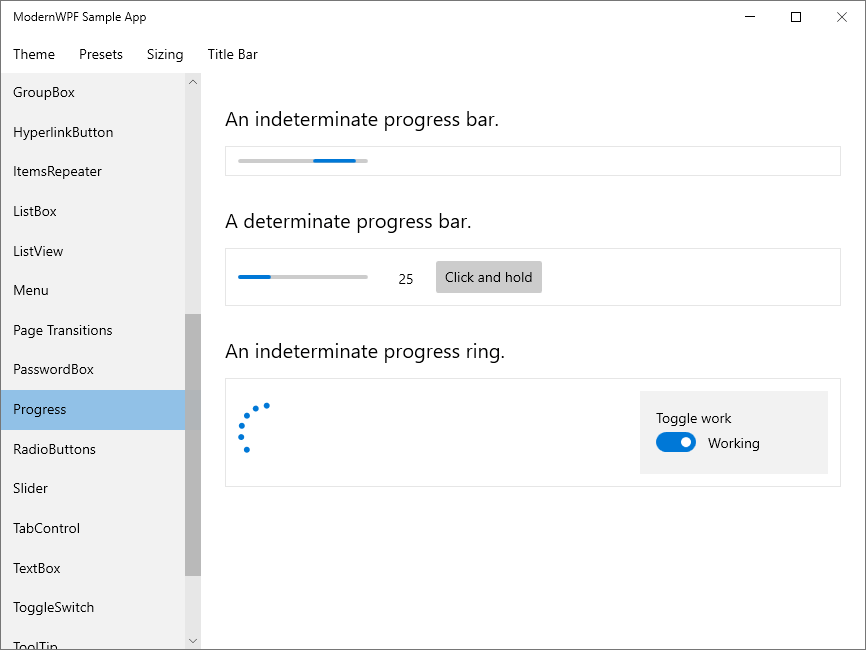

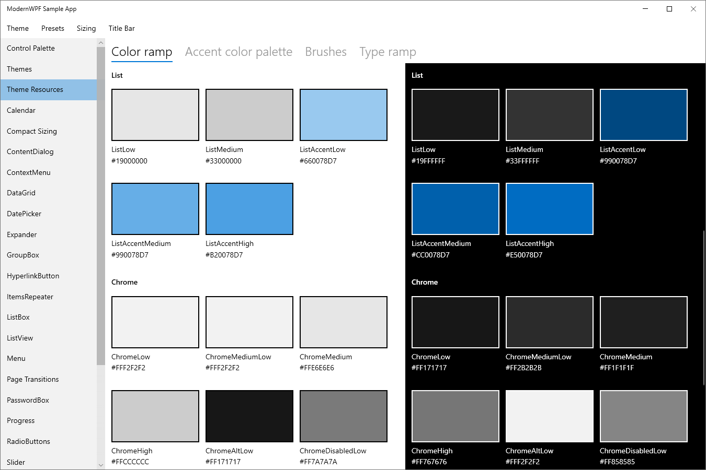

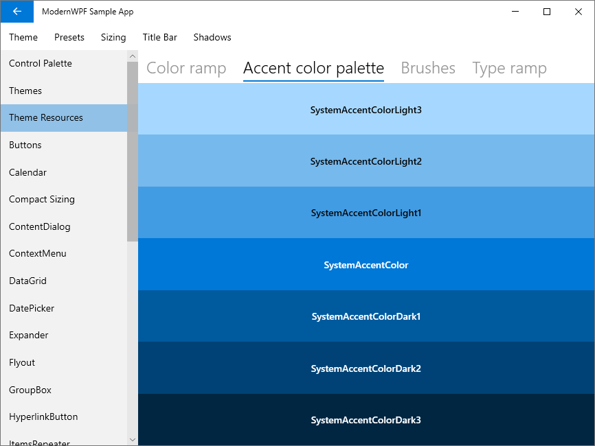

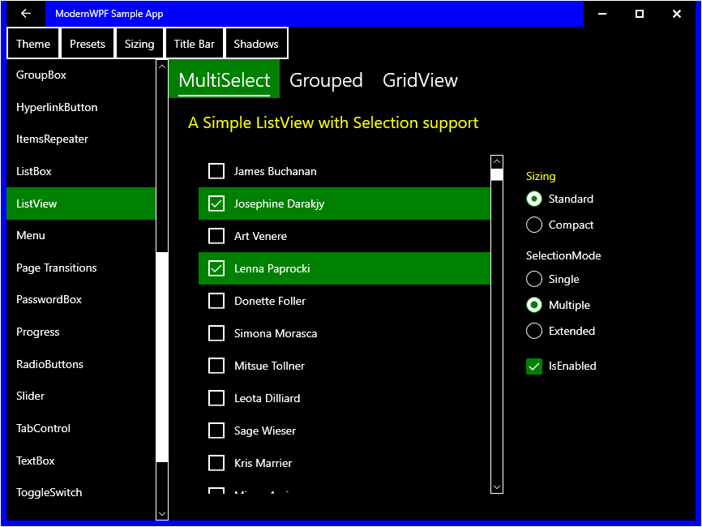

[NuGet]: https://www.nuget.org/packages/ModernWpfUI/
[NuGet.Pre]: https://www.nuget.org/packages/ModernWpfUI/absoluteLatest
[NuGet.MahApps]: https://www.nuget.org/packages/ModernWpfUI.MahApps/
[NuGet.MahApps.Pre]: https://www.nuget.org/packages/ModernWpfUI.MahApps/absoluteLatest
