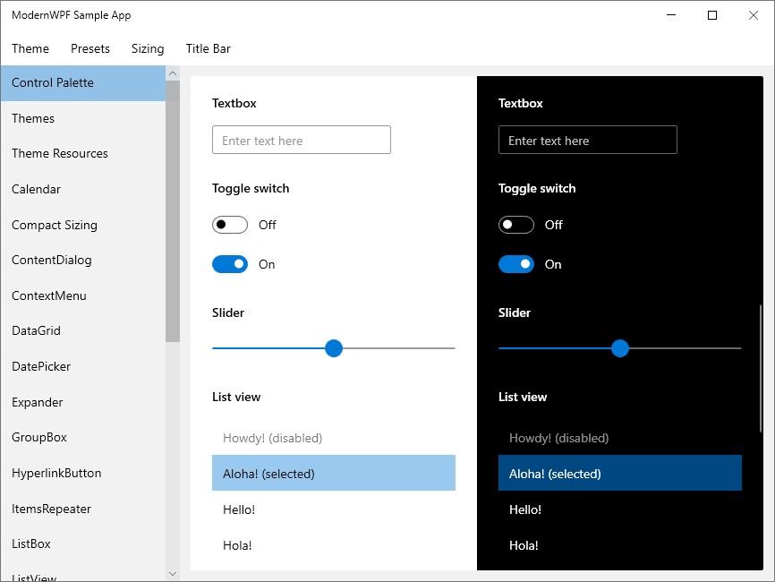

# ModernWPF UI Library
Modern styles and controls for your WPF applications.

## Features
* Modern styles and new features for the majority of the stock WPF controls.

* Light and dark themes that can be easily customized. A high contrast theme is also included.

* Additional controls to help you build modern applications. Some are ported from the [Windows UI Library](https://github.com/microsoft/microsoft-ui-xaml).

* Targets .NET Framework 4.5 and .NET Core 3.0. Runs on Windows Vista SP2 and above.


## Quick start
1. Create a new WPF app.

2. Install from NuGet `Install-Package ModernWpfUI`.

3. Edit App.xaml to following:
```xaml
<Application
    ...
    xmlns:ui="http://schemas.modernwpf.com/2019">
    <Application.Resources>
        <ResourceDictionary>
            <ResourceDictionary.MergedDictionaries>
                <ui:ThemeResources />
                <ui:XamlControlsResources />
            </ResourceDictionary.MergedDictionaries>
        </ResourceDictionary>
    </Application.Resources>
</Application>
```

4. Edit MainWindow.xaml to following:
```xaml
<Window
    ...
    xmlns:ui="http://schemas.modernwpf.com/2019"
    ui:WindowHelper.UseModernWindowStyle="True">
    <Grid>
        <StackPanel Margin="12">
            <TextBlock
                Text="My first ModernWPF app"
                Style="{StaticResource HeaderTextBlockStyle}" />
            <Button
                Content="I am a button"
                Margin="0,24,0,0" />
        </StackPanel>
    </Grid>
</Window>
```

5. See [Common Tasks](https://github.com/Kinnara/ModernWpf/wiki/Common-Tasks) for more usage information.

## Screenshots



