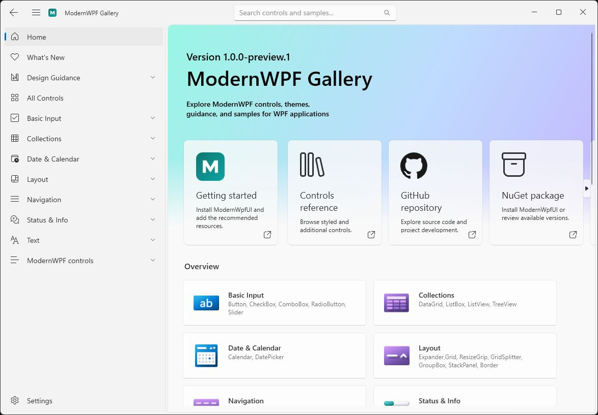

<h1 align="center">ModernWPF</h1>

<p align="center">
  Modern Fluent styles and WinUI-inspired controls for Windows Presentation Foundation.
</p>

<p align="center">
  <a href="https://github.com/Kinnara/ModernWpf/actions/workflows/build.yml">
    
  </a>
  <a href="https://www.nuget.org/packages/ModernWpfUI">
    
  </a>
  <a href="LICENSE">
    
  </a>
</p>

<p align="center">
  <a href="#getting-started">Get started</a>
  <span> · </span>
  <a href="#gallery">Gallery</a>
  <span> · </span>
  <a href="#documentation">Documentation</a>
  <span> · </span>
  <a href="https://github.com/Kinnara/ModernWpf/discussions">Discussions</a>
</p>

ModernWPF is an independent, community-maintained library that brings Fluent
styling and modern controls to
[Windows Presentation Foundation](https://github.com/dotnet/wpf) applications.
It runs directly on WPF; it is not WinUI and does not replace the WPF runtime.

> [!IMPORTANT]
> ModernWPF 1.x is the active preview line. The 0.9.x line is frozen and
> unsupported. No maintenance updates, security fixes, or new 0.9.x releases
> are planned.

> [!NOTE]
> **ModernWPF** is the product and display name. The repository and CLR
> namespaces continue to use `ModernWpf`, and the NuGet package remains
> `ModernWpfUI`.

<picture>
  <source media="(prefers-color-scheme: dark)" srcset="docs/images/Gallery.Dark.png">
  <source media="(prefers-color-scheme: light)" srcset="docs/images/Gallery.Light.png">
  
</picture>

## What ModernWPF provides

- Fluent styling for stock WPF controls, including Light, Dark, High Contrast,
  and compact-resource behavior.
- WPF ports of modern controls such as `NavigationView`, `NumberBox`,
  `ContentDialog`, `InfoBar`, `CommandBarFlyout`, and `ItemsRepeater`.
- Application, window, and element-level theme APIs with a consistent surface
  across every supported target.
- Modern window chrome, title-bar integration, layout helpers, and resource
  primitives for existing WPF applications.
- Source-backed compatibility audits and automated API, resource, theme,
  accessibility, package, and runtime tests.

## Relationship to WPF and WinUI

ModernWPF follows both upstream UI projects, but each has a different role:

| Area | Upstream authority | ModernWPF strategy |
| --- | --- | --- |
| WPF runtime, XAML, layout, and input | [dotnet/wpf](https://github.com/dotnet/wpf) | Build directly on WPF and preserve WPF behavior. |
| Stock control styling | Official WPF Fluent resources | Use the platform Fluent theme on .NET 10 and a compatible ModernWPF backport on older supported targets. |
| Additional modern controls | [microsoft-ui-xaml](https://github.com/microsoft/microsoft-ui-xaml) | Port current WinUI control APIs and behavior where WPF has no equivalent, documenting necessary WPF adaptations. |

ModernWPF is not affiliated with or endorsed by Microsoft.

## Project status

| Line | Status | Policy |
| --- | --- | --- |
| 1.x | Active preview | Current development line. `1.0.0-preview.1` records the first API/resource audit and migration baseline; the [1.0 roadmap](docs/roadmap-1.0.md) carries source-audited feature previews through an API-frozen release candidate before stable `1.0.0` establishes the SemVer boundary. |
| 0.9.x | Frozen and unsupported | Historical packages remain available, but no updates or security fixes are planned. |

Source and binary compatibility with 0.9.x is not promised. Existing
applications should follow the
[0.9.x migration guide](docs/migrating-from-0.9.md), which covers target
framework changes, resource entries, renamed APIs, and the removal of the
MahApps adapter from 1.x.

### Supported targets

| Target framework | Stock control theme | Intended use |
| --- | --- | --- |
| `net462` | ModernWPF Fluent backport | Existing .NET Framework WPF applications. |
| `net8.0-windows7.0` | ModernWPF Fluent backport | Modern .NET WPF applications targeting .NET 8. |
| `net10.0-windows7.0` | Official `PresentationFramework.Fluent` theme | Modern .NET WPF applications targeting .NET 10. |

Retired `net45`, `netcoreapp3.0`, and `net5.0-windows` package assets are not
part of the 1.x line.

## Getting started

Install an explicit 1.x version so NuGet does not select a frozen 0.9.x
package:

```powershell
dotnet add package ModernWpfUI --version 1.0.0-preview.5
```

If the requested preview is not yet listed on NuGet, use a validated workflow
artifact or [build the repository from source](#build-from-source).

Add the recommended 1.x resources to `App.xaml`:

```xaml
<Application
    ...
    xmlns:ui="http://schemas.modernwpf.com/2019">
    <Application.Resources>
        <ResourceDictionary>
            <ResourceDictionary.MergedDictionaries>
                <ui:ThemeResources />
                <ui:FluentControlsResources UseCompactResources="False" />
            </ResourceDictionary.MergedDictionaries>
        </ResourceDictionary>
    </Application.Resources>
</Application>
```

Then opt a window into ModernWPF styling and use the controls from the same
XAML namespace:

```xaml
<Window
    ...
    xmlns:ui="http://schemas.modernwpf.com/2019"
    ui:WindowHelper.UseModernWindowStyle="True">
    <ui:StackPanelEx Margin="24" Spacing="12">
        <TextBlock
            Text="ModernWPF"
            Style="{StaticResource HeaderTextBlockStyle}" />
        <Button Content="Standard button" />
        <Button
            Content="Accent button"
            Style="{StaticResource AccentButtonStyle}" />
    </ui:StackPanelEx>
</Window>
```

`FluentControlsResources` uses official WPF Fluent resources for stock controls
on `net10.0-windows7.0` and the ModernWPF backport on the older supported
targets. Applications that need a staged migration may temporarily retain
`ThemeResources` plus `XamlControlsResources`; new applications should use the
recommended entry above.

## Gallery

[`ModernWpf.Gallery`](ModernWpf.Gallery) is this repository's interactive
catalog and development sample. It demonstrates ModernWPF controls, WPF stock
controls, themes, window chrome, navigation, dialogs, flyouts, and input
behavior. It is a project sample, not Microsoft's official WPF or WinUI
Gallery.

On Windows, install the SDK selected by [`global.json`](global.json), then run:

```powershell
dotnet restore .\ModernWpf.Gallery\ModernWpf.Gallery.csproj
dotnet run --project .\ModernWpf.Gallery\ModernWpf.Gallery.csproj `
    --configuration Debug `
    --framework net10.0-windows7.0 `
    --no-restore
```

Use `net8.0-windows7.0` to exercise that supported target. Building `net462`
also requires the .NET Framework 4.6.2 Developer Pack. In Visual Studio, open
`ModernWpf.sln` and select `ModernWpf.Gallery` as the startup project.

## Documentation

| Resource | Purpose |
| --- | --- |
| [1.0 roadmap](docs/roadmap-1.0.md) | Planned feature previews, the API-frozen release candidate, downstream evidence, and stable graduation rules. |
| [1.0.0-preview.5 release notes](docs/release-notes-1.0.0-preview.5.md) | Current TabView milestone, WPF tear-out adaptation, validation, and preview limitations. |
| [1.0.0-preview.4 release notes](docs/release-notes-1.0.0-preview.4.md) | TitleBar, Mica, Desktop Acrylic, fallback behavior, and migration information. |
| [1.0.0-preview.3 release notes](docs/release-notes-1.0.0-preview.3.md) | TimePicker and TwoPaneView APIs, WPF adaptations, and migration information. |
| [1.0.0-preview.2 release notes](docs/release-notes-1.0.0-preview.2.md) | Synchronization, packaging, migration, and known-preview information. |
| [1.0.0-preview.1 release notes](docs/release-notes-1.0.0-preview.1.md) | Package changes, intentional 0.9 breaks, recommended resources, and preview limitations. |
| [Migrating from 0.9.x](docs/migrating-from-0.9.md) | Step-by-step application migration guidance. |
| [1.x public API contract](docs/public-api-contract-1x.md) | Preview governance and stable compatibility policy for CLR APIs and public resource keys. |
| [WinUI source parity](docs/winui3-source-parity.md) | Adopted stable/main/Gallery pins, source-audit rules, milestone dispositions, and continuous drift monitoring. |

## Build from source

Building requires Windows, the .NET SDK selected by [`global.json`](global.json),
and the Visual Studio **.NET desktop development** workload or equivalent build
tools. The `net462` target also requires the .NET Framework 4.6.2 Developer
Pack.

Restore and build serially from the repository root:

```powershell
dotnet restore ModernWpf.sln
dotnet build ModernWpf.sln --configuration Release --no-restore --maxcpucount:1
```

See [release readiness](docs/release-readiness-1x.md) for the complete test,
package verification, and executable consumer-smoke commands. Solution builds
and test builds should not run in parallel because WPF projects can contend for
shared intermediate files.

## Contributing and feedback

- Use [Discussions](https://github.com/Kinnara/ModernWpf/discussions) for
  questions, design ideas, and broader proposals.
- Use the structured [Preview bug form](https://github.com/Kinnara/ModernWpf/issues/new?template=preview-bug.yml)
  for reproducible 1.0 preview problems, and [Issues](https://github.com/Kinnara/ModernWpf/issues)
  for focused feature requests.
- Read the related source-audit document under [`docs`](docs) before changing a
  WinUI-derived control or stock WPF template.
- Add focused regression coverage and run the affected test project before
  submitting a change.

## License

ModernWPF is licensed under the [MIT License](LICENSE). WPF and WinUI source
references retain their respective upstream notices and licenses.
