# ModernWPF UI Library
[](https://gitter.im/ModernWpf/community?utm_source=badge&utm_medium=badge&utm_campaign=pr-badge)

Modern styles and controls for your WPF applications.

## Maintenance status

ModernWpf is restarting active maintenance on a new 1.x line.

| Line | Status | Support |
| --- | --- | --- |
| 0.9.x | Legacy | Security-only fixes for existing applications. |
| 1.x | Active preview | New maintenance line for current WPF applications. |

The NuGet package name remains `ModernWpfUI`. The first 1.x maintenance
release candidate is `1.0.0-preview.1`.
See the [1.x public API contract](docs/public-api-contract-1x.md) for the
forward-compatibility boundary and the comparison with 0.9.x, current WinUI,
and official WPF Fluent.
Applications upgrading from 0.9.x should also read the
[migration guide](docs/migrating-from-0.9.md) and
[preview release notes](docs/release-notes-1.0.0-preview.1.md).

## Supported targets

| Target framework | Theme source | Notes |
| --- | --- | --- |
| `net462` | ModernWpf Fluent backport | Compatibility target for existing .NET Framework WPF apps. |
| `net8.0-windows7.0` | ModernWpf Fluent backport | Current LTS target for WPF apps. |
| `net10.0-windows7.0` | WPF platform Fluent theme plus ModernWpf controls | Uses the official `PresentationFramework.Fluent` resources for stock WPF controls. |

## Features
* Modern styles and new features for [the majority of the stock WPF controls](https://github.com/Kinnara/ModernWpf/wiki/Controls#styled-controls).

* Light and dark themes that can be easily customized. A high contrast theme is also included.

* [Additional controls](https://github.com/Kinnara/ModernWpf/wiki/Controls#additional-controls) to help you build modern applications. Some are ported from the [Windows UI Library](https://github.com/microsoft/microsoft-ui-xaml).

* Targets .NET Framework 4.6.2, .NET 8 for Windows, and .NET 10 for Windows.

")

## Quick start
1. Create a new WPF app.

2. Install from NuGet `Install-Package ModernWpfUI`.

3. Edit App.xaml to use the recommended 1.x resource entry:
```xaml
<Application
    ...
    xmlns:ui="http://schemas.modernwpf.com/2019">
    <Application.Resources>
        <ResourceDictionary>
            <ResourceDictionary.MergedDictionaries>
                <ui:ThemeResources />
                <ui:FluentControlsResources UseCompactResources="False" />
            </ResourceDictionary.MergedDictionaries>
        </ResourceDictionary>
    </Application.Resources>
</Application>
```

`FluentControlsResources` uses the official WPF Fluent theme on `net10.0-windows7.0` and the ModernWpf Fluent backport on older supported targets.
On `net10.0-windows7.0`, `ThemeManager.ApplicationTheme` and window
`ThemeManager.RequestedTheme` are also bridged to the official WPF
`ThemeMode` APIs. Element-level theme islands continue to use ModernWpf's
WinUI-compatible resource dictionaries so existing per-control theme scopes keep
working on every supported target.

For existing 0.9.x applications, the old resource entry remains supported:
```xaml
<Application
    ...
    xmlns:ui="http://schemas.modernwpf.com/2019">
    <Application.Resources>
        <ResourceDictionary>
            <ResourceDictionary.MergedDictionaries>
                <ui:ThemeResources />
                <ui:XamlControlsResources />
            </ResourceDictionary.MergedDictionaries>
        </ResourceDictionary>
    </Application.Resources>
</Application>
```

4. Edit MainWindow.xaml to following:
```xaml
<Window
    ...
    xmlns:ui="http://schemas.modernwpf.com/2019"
    ui:WindowHelper.UseModernWindowStyle="True">
    <ui:StackPanelEx Margin="12" Spacing="24">
        <TextBlock Text="My first ModernWPF app" Style="{StaticResource HeaderTextBlockStyle}" />
        <Button Content="I am a button" />
        <Button Content="I am an accent button" Style="{StaticResource AccentButtonStyle}" />
    </ui:StackPanelEx>
</Window>
```

5. See [the wiki](https://github.com/Kinnara/ModernWpf/wiki) for more information.

## Build and run the Gallery

The sample application for the active 1.x line is
`ModernWpf.Gallery` (formerly `ModernWpf.SampleApp`). Build the Gallery project
directly so unrelated test and integration projects are not required.

On Windows, install the .NET SDK selected by [`global.json`](global.json). If
you use Visual Studio, also install the **.NET desktop development** workload.
Then run these commands from the repository root:

```powershell
dotnet restore .\ModernWpf.Gallery\ModernWpf.Gallery.csproj
dotnet build .\ModernWpf.Gallery\ModernWpf.Gallery.csproj --configuration Debug --framework net10.0-windows7.0 --no-restore
dotnet run --project .\ModernWpf.Gallery\ModernWpf.Gallery.csproj --configuration Debug --framework net10.0-windows7.0 --no-build
```

Use `net8.0-windows7.0` instead to run that supported target. Building
`net462` also requires the .NET Framework 4.6.2 Developer Pack. In Visual
Studio, open `ModernWpf.sln`, set `ModernWpf.Gallery` as the startup project,
choose a supported target framework, and start debugging.

The built executable is written under
`ModernWpf.Gallery\bin\Debug\<target-framework>\ModernWpf.Gallery.exe`.
GitHub releases publish the library packages rather than a separate Gallery
binary.

## Packages
| NuGet Package | Latest Versions |
| --- | --- |
| [ModernWpfUI][NuGet] | [][NuGet]<br />[][NuGet.Pre] |

## Screenshots
")

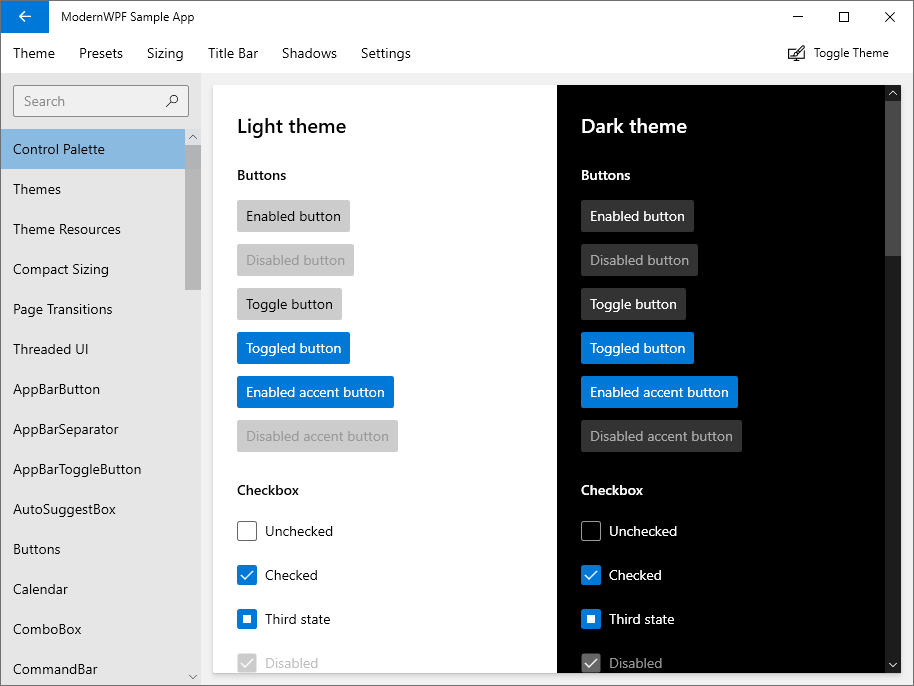

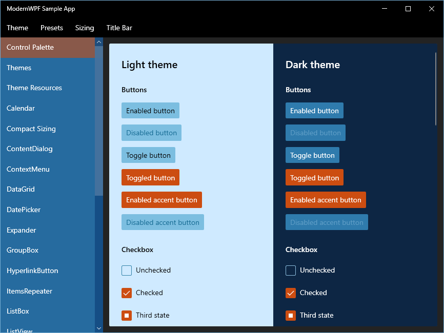

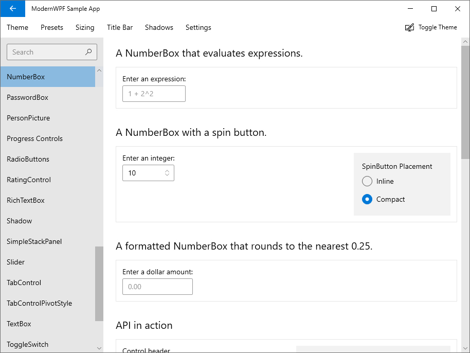

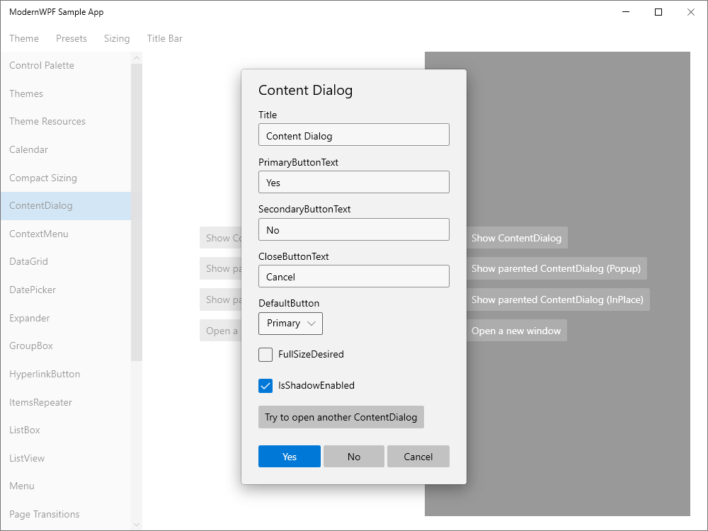

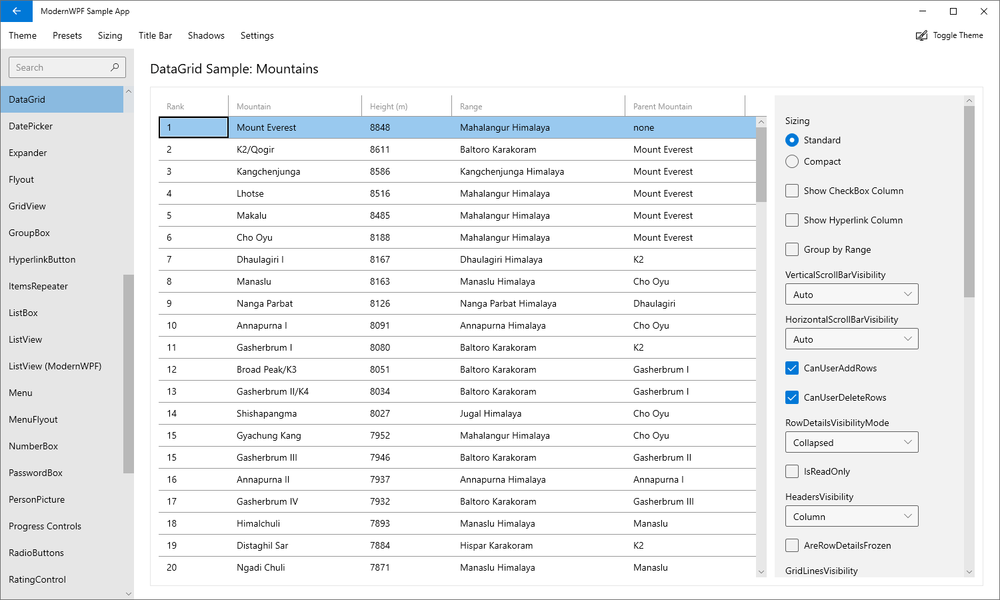

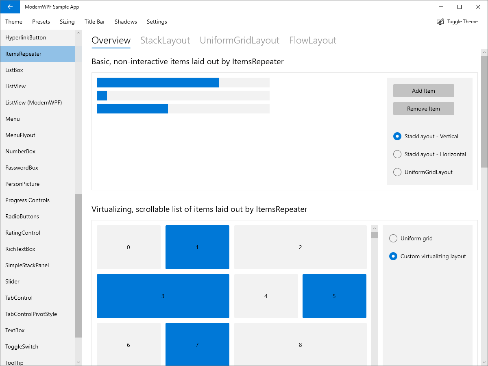

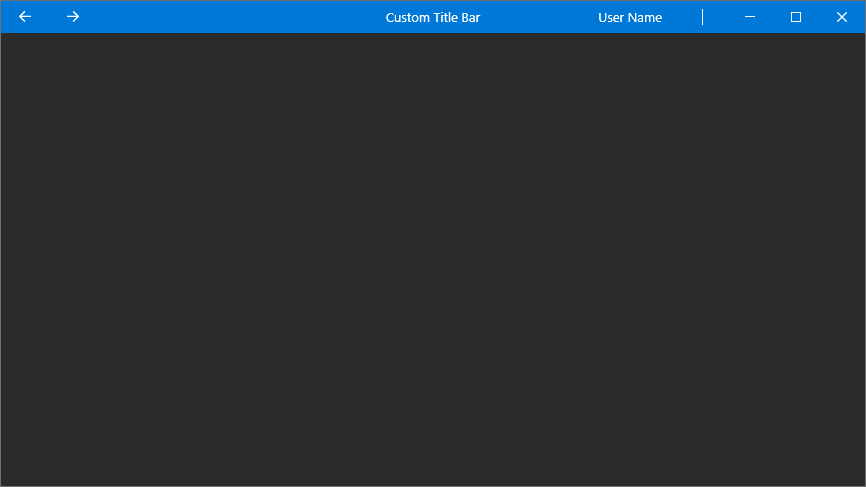

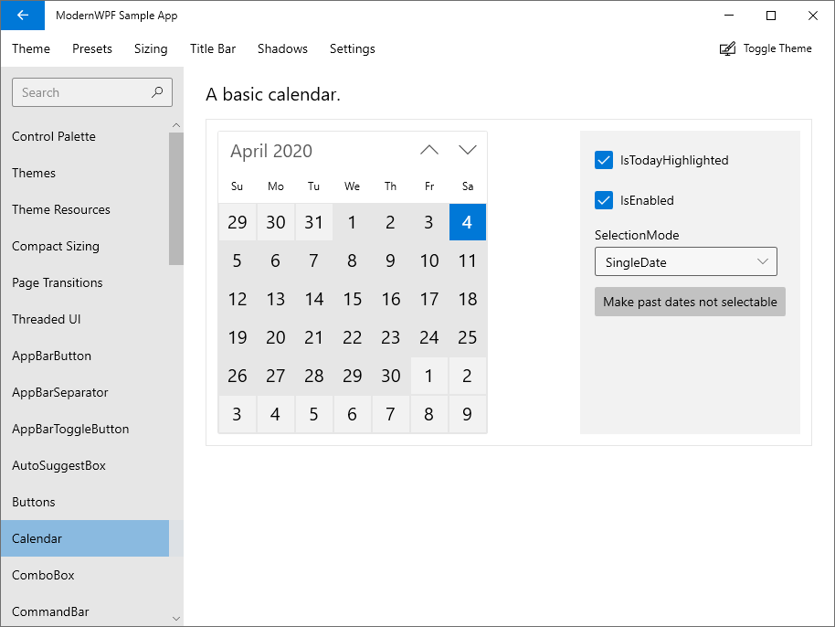

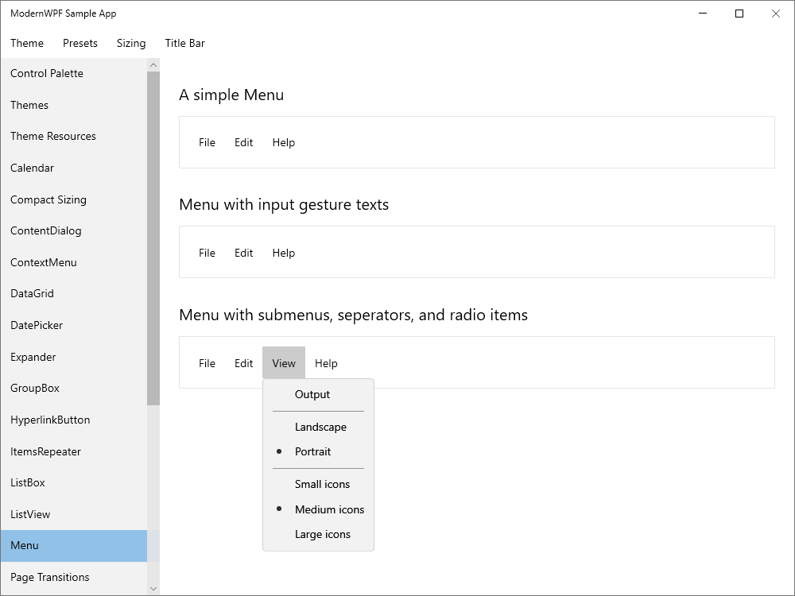

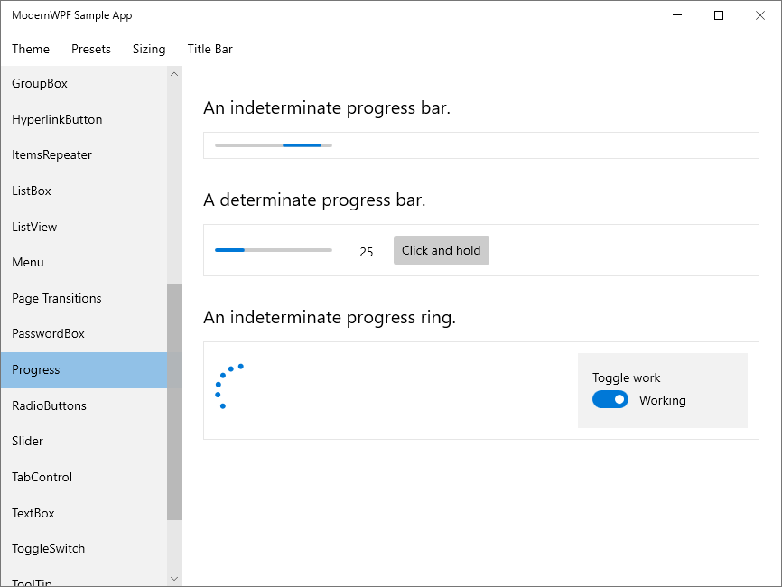

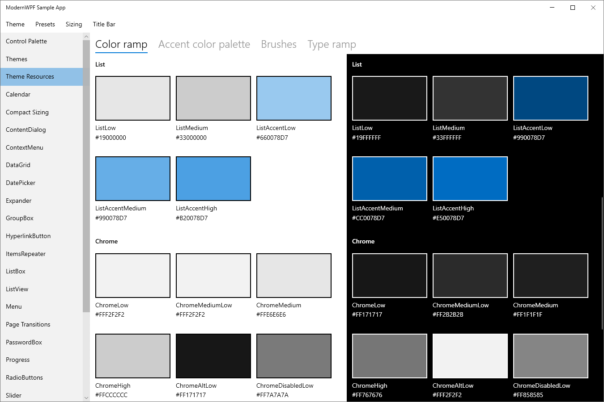

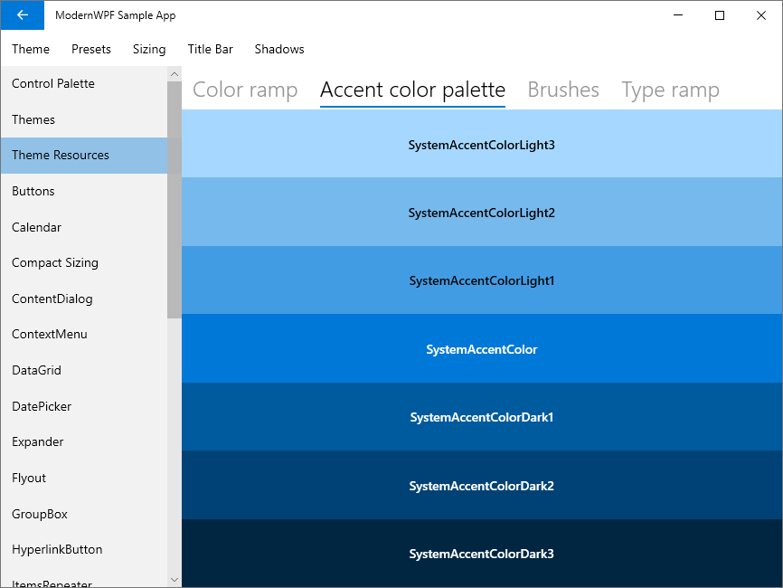

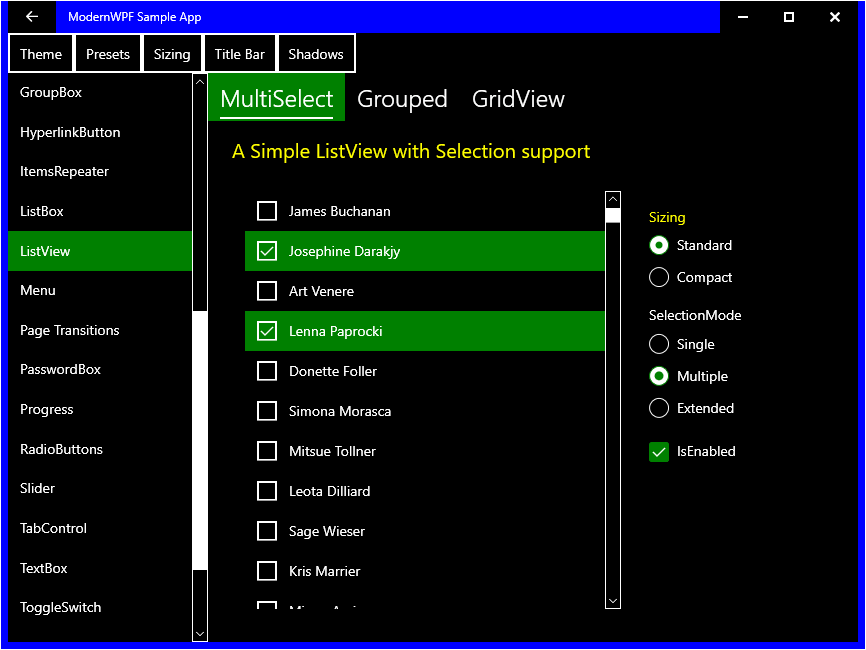

[NuGet]: https://www.nuget.org/packages/ModernWpfUI/
[NuGet.Pre]: https://www.nuget.org/packages/ModernWpfUI/absoluteLatest
